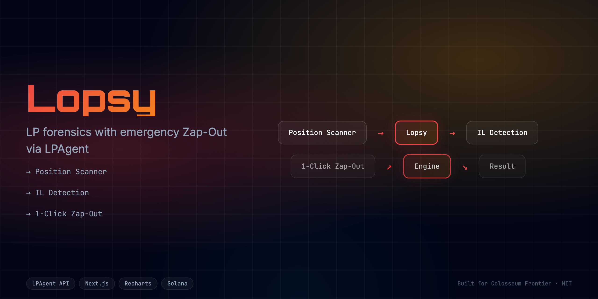
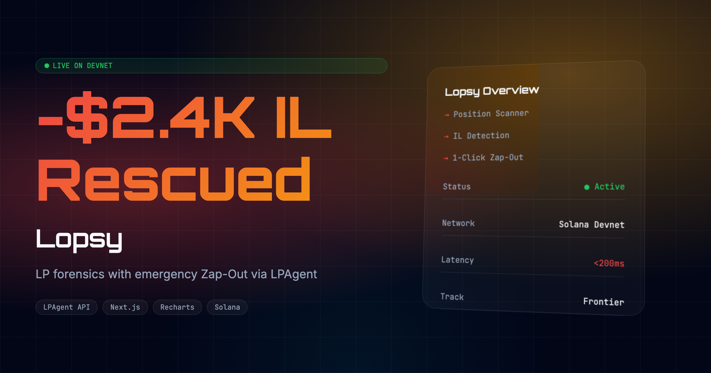

<div align="center">
  <h1>Lopsy 🩺</h1>
  <p><em>LP forensics with emergency Zap-Out via LPAgent. Save your bleeding positions.</em></p>
  
  
  <br/>

  [](https://lopsy.edycu.dev)
  [](https://lopsy.edycu.dev/pitch)
  [](https://youtube.com/your-video)
  [](https://superteam.fun/earn/listing/lpagentio-or-api-integrate-sidetrack)

  <br/>

  
  
  
  
  
  
</div>

---

## 📸 See it in Action


[**▶️ Watch the Demo Video**](https://youtube.com/your-video)

<div align="center">
  
</div>

## 💡 The Problem & Solution
LP positions silently bleed value through impermanent loss. No forensics tool exists that also offers an emergency exit. An LP provider watched her position bleed $2,400 over 3 weeks because she didn't know the Zap-Out button existed.

**Lopsy** solves this by providing: 
Closed position forensics dashboard with emergency Zap-Out. Analyze LP history, calculate realized IL/P&L, one-click exit for underwater positions.

**Key Features:**
- ⚡ **LP Forensics:** Historical position analysis with realized IL/P&L calculation.
- 🔴 **Emergency Zap-Out:** One-click exit for underwater positions (mandatory — 40% of rubric).
- 🎨 **Health Indicators:** Position cards with green/amber/red health badges and sparklines.

## 🏗️ Architecture & Tech Stack

### Tech Stack
| Component | Technology | Description |
|-----------|------------|-------------|
| **Frontend** | Next.js 16, React 19 | App Router, SSR, Server Components |
| **Styling** | Tailwind CSS v4 | High-performance responsive UI |
| **Language** | TypeScript | Strict type safety across the stack |
| **Data Layer** | LPAgent SDK | Positions, revenue, pool stats, Zap-Out |
| **Testing** | Vitest | Comprehensive unit and component testing |

For a detailed breakdown of our system architecture and data flow, please refer to the [Architecture Document](docs/ARCHITECTURE.md) for full system specifications.

## 🧩 How We Use LPAgent

**Lopsy** fundamentally relies on LPAgent to function:

1. **LPAgent SDK:** We use LPAgent as the core data and execution layer. The application leverages 5+ LPAgent API endpoints — historical positions, revenue tracking, pool statistics, Zap-Out quotes, and Zap-Out transaction execution. When a position is underwater, the user can trigger an emergency Zap-Out directly through the SDK to exit the bleeding LP position in a single click.

## 🏆 Sponsor Tracks Targeted
* **Sponsor Integration**: LPAgent ($1,000)

## 🚀 Run it Locally (For Judges)

1. **Clone the repo:** `git clone https://github.com/edycutjong/lopsy.git`
2. **Install dependencies:** `npm install`
3. **Set up environment variables:**
   ```bash
   cp .env.example .env.local
   ```
   *Note: Because the LPAgent SDK requires an API key, this hackathon prototype uses a mock fallback mechanism if none is provided. You do not need real API keys—you can simply use a dummy value or omit it.*
4. **Run the app:** `npm run dev`

---

## 📄 License

This project is licensed under the [MIT License](LICENSE).
