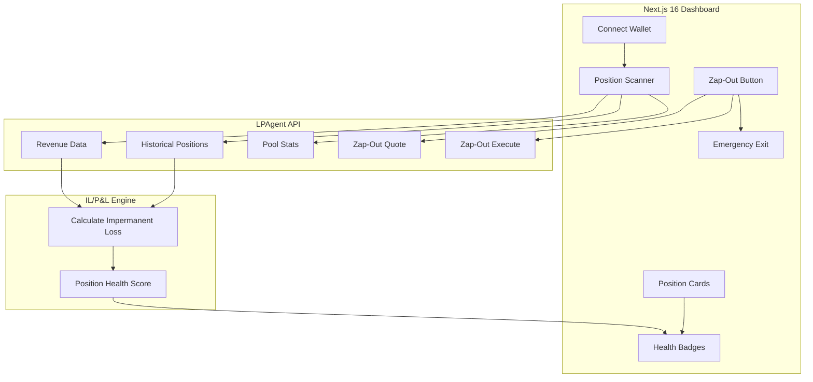

# Lopsy — Technical Architecture

## System Architecture



## Tech Stack

| Layer | Technology |
|---|---|
| **Frontend** | Next.js 16, React 19, Tailwind v4 |
| **Data** | LPAgent API |
| **Database** | Supabase (cached positions) |

## LPAgent API Integration Map

| Endpoint | Use Case | Depth |
|---|---|---|
| **Historical Positions** | Fetch closed + active LP positions | 🟢 Core |
| **Revenue Data** | Fee earnings per position | 🟢 Core |
| **Pool Stats** | TVL, volume, APR per pool | 🟢 Core |
| **Zap-Out Quote** | Get exit quote for position | 🟢 Mandatory (40% rubric) |
| **Zap-Out Execute** | One-click emergency exit tx | 🟢 Mandatory (40% rubric) |

## API Routes

| Method | Path | Description |
|---|---|---|
| GET | `/api/positions` | Fetch LP positions for wallet |
| GET | `/api/positions/:id/pnl` | Calculate IL/P&L for position |
| GET | `/api/pools` | Pool comparison table |
| POST | `/api/zapout/quote` | Get Zap-Out quote |
| POST | `/api/zapout/execute` | Execute emergency exit |

## Database Schema

```sql
CREATE TABLE positions (
    id UUID PRIMARY KEY DEFAULT gen_random_uuid(),
    wallet TEXT NOT NULL,
    pool_address TEXT NOT NULL,
    entry_value NUMERIC,
    current_value NUMERIC,
    il_amount NUMERIC,
    health TEXT CHECK (health IN ('green', 'amber', 'red')),
    cached_at TIMESTAMPTZ DEFAULT NOW()
);
```
